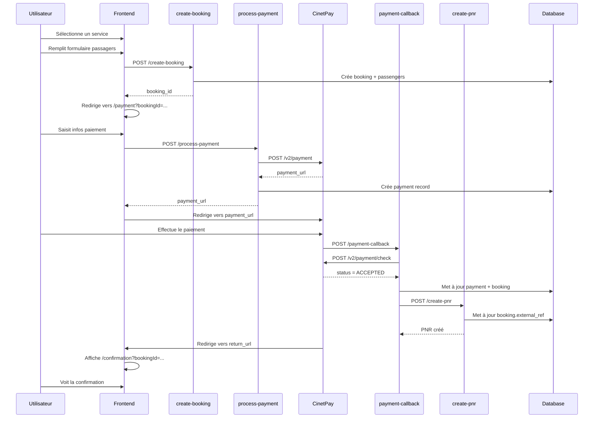

# B-Reserve - Documentation API

## Vue d'ensemble

B-Reserve est un système de réservation et de paiement inspiré de Kiwi.com, utilisant CinetPay comme fournisseur de paiement. Le système est construit sur Supabase (base de données + Edge Functions) et un frontend React.

## Architecture

```
┌─────────────┐      ┌─────────────────┐      ┌──────────────┐
│   Frontend  │────▶│  Edge Functions │────▶│   Supabase   │
│   (React)   │      │   (Deno/TS)     │      │   Database   │
└─────────────┘      └─────────────────┘      └──────────────┘
                             │
                             ▼
                      ┌──────────────┐
                      │   CinetPay   │
                      │     API      │
                      └──────────────┘
```

---

## Base de données

### Table `bookings`
Stocke les réservations des utilisateurs.

| Colonne | Type | Description |
|---------|------|-------------|
| `id` | UUID | Identifiant unique |
| `user_id` | UUID | Référence utilisateur |
| `service_id` | UUID | Référence service |
| `status` | ENUM | `pending`, `paid`, `confirmed`, `failed` |
| `payment_status` | ENUM | `pending`, `paid`, `completed`, `failed` |
| `external_ref` | TEXT | PNR ou référence fournisseur |
| `start_date` | DATE | Date de début |
| `end_date` | DATE | Date de fin (optionnelle) |
| `guests` | INTEGER | Nombre de passagers |
| `total_price` | NUMERIC | Montant total |
| `currency` | TEXT | Devise (XOF, EUR, etc.) |
| `customer_name` | TEXT | Nom du client |
| `customer_email` | TEXT | Email du client |
| `customer_phone` | TEXT | Téléphone du client |
| `notes` | TEXT | Notes additionnelles |
| `booking_details` | JSONB | Détails supplémentaires |
| `created_at` | TIMESTAMP | Date de création |
| `updated_at` | TIMESTAMP | Date de mise à jour |

### Table `passengers`
Stocke les informations des passagers pour chaque réservation.

| Colonne | Type | Description |
|---------|------|-------------|
| `id` | UUID | Identifiant unique |
| `booking_id` | UUID | Référence réservation |
| `first_name` | TEXT | Prénom |
| `last_name` | TEXT | Nom |
| `date_of_birth` | DATE | Date de naissance |
| `document_type` | TEXT | Type de document (passport, id_card, etc.) |
| `document_number` | TEXT | Numéro de document |
| `nationality` | TEXT | Nationalité |
| `created_at` | TIMESTAMP | Date de création |
| `updated_at` | TIMESTAMP | Date de mise à jour |

### Table `payments`
Stocke les informations de paiement.

| Colonne | Type | Description |
|---------|------|-------------|
| `id` | UUID | Identifiant unique |
| `booking_id` | UUID | Référence réservation |
| `user_id` | UUID | Référence utilisateur |
| `amount` | NUMERIC | Montant |
| `currency` | VARCHAR | Devise |
| `payment_method` | VARCHAR | Méthode de paiement |
| `payment_provider` | VARCHAR | Fournisseur (cinetpay) |
| `transaction_id` | VARCHAR | ID transaction CinetPay |
| `status` | VARCHAR | `pending`, `initiated`, `completed`, `failed` |
| `payment_data` | JSONB | Données supplémentaires |
| `created_at` | TIMESTAMP | Date de création |
| `updated_at` | TIMESTAMP | Date de mise à jour |

### Table `services`
Stocke les services disponibles (vols, hôtels, etc.).

| Colonne | Type | Description |
|---------|------|-------------|
| `id` | UUID | Identifiant unique |
| `type` | ENUM | Type de service |
| `name` | TEXT | Nom du service |
| `description` | TEXT | Description |
| `location` | TEXT | Lieu |
| `price_per_unit` | NUMERIC | Prix unitaire |
| `currency` | TEXT | Devise |
| `available` | BOOLEAN | Disponibilité |
| `created_at` | TIMESTAMP | Date de création |
| `updated_at` | TIMESTAMP | Date de mise à jour |

---

## Edge Functions

### 1. `create-booking`

Crée une nouvelle réservation avec les passagers.

**URL:** `{SUPABASE_URL}/functions/v1/create-booking`

**Méthode:** `POST`

**Authentication:** Requise (JWT Bearer token)

**Body:**
```json
{
  "service_id": "uuid-optional",
  "service_type": "flight",
  "service_name": "Vol Paris-Abidjan",
  "service_description": "Vol direct AF",
  "location": "Paris CDG - Abidjan FHB",
  "start_date": "2025-12-25",
  "end_date": "2025-12-30",
  "guests": 2,
  "total_price": 850000,
  "currency": "XOF",
  "customer_name": "Jean Dupont",
  "customer_email": "jean@example.com",
  "customer_phone": "+225 0707070707",
  "notes": "Siège côté hublot",
  "passengers": [
    {
      "first_name": "Jean",
      "last_name": "Dupont",
      "date_of_birth": "1990-01-01",
      "document_type": "passport",
      "document_number": "FR123456",
      "nationality": "Française"
    },
    {
      "first_name": "Marie",
      "last_name": "Dupont",
      "date_of_birth": "1992-05-15",
      "document_type": "passport",
      "document_number": "FR789012",
      "nationality": "Française"
    }
  ],
  "booking_details": {
    "flight_number": "AF704",
    "seat_preference": "window"
  }
}
```

**Response Success (200):**
```json
{
  "success": true,
  "booking_id": "uuid",
  "status": "pending",
  "message": "Booking created successfully"
}
```

**Response Error (500):**
```json
{
  "success": false,
  "error": "Error message"
}
```

---

### 2. `process-payment` (initiatePayment)

Initie un paiement via CinetPay.

**URL:** `{SUPABASE_URL}/functions/v1/process-payment`

**Méthode:** `POST`

**Authentication:** Requise (JWT Bearer token)

**Body:**
```json
{
  "bookingId": "uuid",
  "amount": 850000,
  "currency": "XOF",
  "paymentMethod": "mobile_money",
  "customerInfo": {
    "name": "Jean Dupont",
    "email": "jean@example.com",
    "phone": "+225 0707070707",
    "address": "123 Rue de la Paix",
    "city": "Abidjan"
  }
}
```

**Response Success (200):**
```json
{
  "success": true,
  "payment_url": "https://checkout.cinetpay.com/payment/...",
  "transaction_id": "TXN-uuid-timestamp",
  "payment_id": "uuid"
}
```

**Response Error (500):**
```json
{
  "success": false,
  "error": "Error message"
}
```

**Données envoyées à CinetPay:**
```json
{
  "apikey": "CINETPAY_API_KEY",
  "site_id": "CINETPAY_SITE_ID",
  "transaction_id": "TXN-uuid-timestamp",
  "amount": 850000,
  "currency": "XOF",
  "description": "Booking #uuid",
  "customer_name": "Jean",
  "customer_surname": "Dupont",
  "customer_email": "jean@example.com",
  "customer_phone_number": "+2250707070707",
  "customer_address": "123 Rue de la Paix",
  "customer_city": "Abidjan",
  "customer_country": "CI",
  "customer_state": "CI",
  "customer_zip_code": "00225",
  "notify_url": "{SUPABASE_URL}/functions/v1/payment-callback",
  "return_url": "https://traversee-connect.lovable.app/confirmation?bookingId=uuid",
  "channels": "MOBILE_MONEY",
  "lang": "fr",
  "metadata": "{\"booking_id\":\"uuid\",\"user_id\":\"uuid\",\"payment_method\":\"mobile_money\"}"
}
```

---

### 3. `payment-callback` (cinetpayCallback)

Webhook appelé par CinetPay pour notifier du statut du paiement.

**URL:** `{SUPABASE_URL}/functions/v1/payment-callback`

**Méthode:** `POST`

**Authentication:** Non requise (public)

**Body (envoyé par CinetPay):**
```json
{
  "cpm_trans_id": "TXN-uuid-timestamp",
  "cpm_site_id": "CINETPAY_SITE_ID",
  "signature": "hash",
  "payment_method": "WAVE",
  "cpm_amount": "850000",
  "cpm_currency": "XOF",
  "cpm_payid": "cinetpay_payment_id"
}
```

**Processus:**
1. Vérifie l'idempotence (évite le double traitement)
2. Vérifie le `site_id`
3. Appelle l'API CinetPay `/v2/payment/check` pour vérifier le statut
4. Met à jour la table `payments`
5. Met à jour la table `bookings`
6. Si statut = "ACCEPTED", déclenche `create-pnr`
7. Génère une facture

**Response:**
```json
{
  "success": true,
  "status": "ACCEPTED",
  "booking_id": "uuid"
}
```

---

### 4. `create-pnr` (createPNRJob)

Crée un PNR (Passenger Name Record) auprès du fournisseur.

**URL:** `{SUPABASE_URL}/functions/v1/create-pnr`

**Méthode:** `POST`

**Authentication:** Non requise (appelée en interne)

**Body:**
```json
{
  "booking_id": "uuid"
}
```

**Processus:**
1. Récupère les détails de la réservation
2. Vérifie que le paiement est complété
3. Appelle l'API du fournisseur (Amadeus, Sabre, etc.) - **actuellement mockée**
4. Génère un PNR (format: `BR12345678`)
5. Met à jour la réservation avec `external_ref` et `status = confirmed`

**Response Success (200):**
```json
{
  "success": true,
  "pnr": "BR12345678",
  "booking_id": "uuid",
  "status": "confirmed"
}
```

**Response Error (500):**
```json
{
  "success": false,
  "error": "Provider API error - PNR creation failed",
  "booking_id": "uuid",
  "status": "failed"
}
```

---

## Flow Complet de Réservation



---

## États de Réservation

### `bookings.status`
- **`pending`**: Réservation créée, en attente de paiement
- **`paid`**: Paiement accepté, en attente de confirmation PNR
- **`confirmed`**: PNR créé, réservation confirmée
- **`failed`**: Échec de la création du PNR

### `payments.status`
- **`pending`**: Paiement créé, en attente d'initiation
- **`initiated`**: URL de paiement générée
- **`completed`**: Paiement accepté par CinetPay
- **`failed`**: Paiement refusé

---

## Sécurité

### RLS (Row Level Security)

**Bookings:**
- Les utilisateurs ne peuvent voir que leurs propres réservations
- Les admins peuvent voir toutes les réservations

**Passengers:**
- Accessible uniquement via la réservation associée
- Les utilisateurs ne peuvent accéder qu'aux passagers de leurs réservations

**Payments:**
- Les utilisateurs ne peuvent voir que leurs propres paiements
- Le service role peut mettre à jour les paiements (pour les webhooks)

### Authentication

- **Frontend → create-booking**: JWT requis
- **Frontend → process-payment**: JWT requis
- **CinetPay → payment-callback**: Public (vérification via signature)
- **Internal → create-pnr**: Service role (appelé depuis payment-callback)

---

## Configuration Requise

### Variables d'environnement (Supabase Secrets)

```bash
CINETPAY_API_KEY=your_api_key
CINETPAY_SITE_ID=your_site_id
SUPABASE_URL=https://project.supabase.co
SUPABASE_SERVICE_ROLE_KEY=your_service_role_key
SUPABASE_ANON_KEY=your_anon_key
```

### CinetPay Configuration

1. Créer un compte sur [CinetPay](https://cinetpay.com)
2. Obtenir `API Key` et `Site ID`
3. Configurer les URLs:
   - **notify_url**: `{SUPABASE_URL}/functions/v1/payment-callback`
   - **return_url**: `https://your-domain.com/confirmation?bookingId={booking_id}`

---

## Tests

### Test create-booking
```bash
curl -X POST {SUPABASE_URL}/functions/v1/create-booking \
  -H "Authorization: Bearer YOUR_JWT" \
  -H "Content-Type: application/json" \
  -d '{
    "service_type": "flight",
    "service_name": "Test Flight",
    "location": "Paris-Abidjan",
    "start_date": "2025-12-25",
    "guests": 1,
    "total_price": 500000,
    "currency": "XOF",
    "customer_name": "Test User",
    "customer_email": "test@example.com",
    "customer_phone": "+225 0707070707",
    "passengers": [
      {
        "first_name": "Test",
        "last_name": "User"
      }
    ]
  }'
```

### Test process-payment
```bash
curl -X POST {SUPABASE_URL}/functions/v1/process-payment \
  -H "Authorization: Bearer YOUR_JWT" \
  -H "Content-Type: application/json" \
  -d '{
    "bookingId": "uuid",
    "amount": 500000,
    "currency": "XOF",
    "paymentMethod": "mobile_money",
    "customerInfo": {
      "name": "Test User",
      "email": "test@example.com",
      "phone": "+225 0707070707"
    }
  }'
```

---

## Gestion des Erreurs

### Erreurs Courantes

| Code | Message | Solution |
|------|---------|----------|
| 401 | Unauthorized | Vérifier le JWT token |
| 400 | Missing required fields | Vérifier tous les champs requis |
| 500 | Payment gateway not configured | Vérifier CINETPAY_API_KEY et CINETPAY_SITE_ID |
| 500 | Booking not found | Vérifier que le booking_id existe |
| 500 | Payment not completed | Attendre la confirmation du paiement |

### Logs

Tous les Edge Functions incluent des logs détaillés:
```
=== FUNCTION_NAME START ===
... détails de la requête ...
✅ Success message
=== FUNCTION_NAME END ===
```

ou

```
❌ ERROR in function-name: error details
```

---

## Améliorations Futures

1. **Intégration réelle avec fournisseurs**
   - Amadeus API pour les vols
   - Booking.com API pour les hôtels
   
2. **Notifications**
   - Email de confirmation automatique
   - SMS de rappel
   
3. **Gestion des annulations**
   - Remboursements via CinetPay
   - Politiques d'annulation
   
4. **Multi-devises**
   - Conversion automatique
   - Affichage des prix dans la devise préférée
   
5. **Analytics**
   - Tableau de bord admin
   - Rapports de ventes
   
---

## Support

Pour toute question technique:
- Documentation CinetPay: https://docs.cinetpay.com
- Documentation Supabase: https://supabase.com/docs
- Support B-Reserve: support@b-reserve.com
